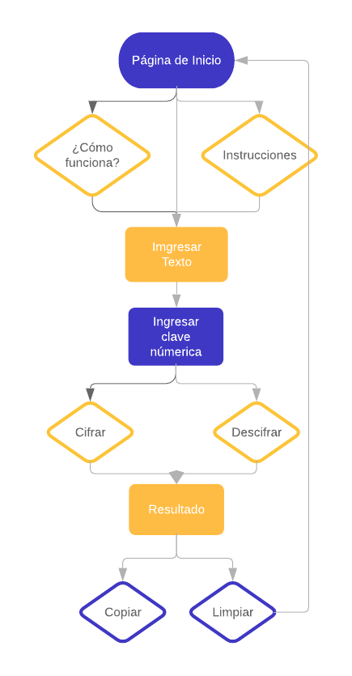
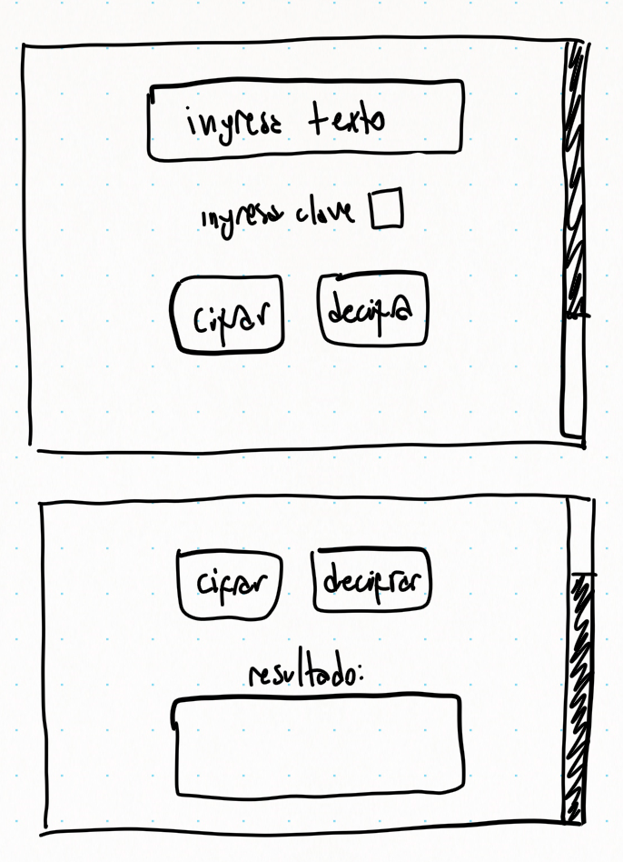
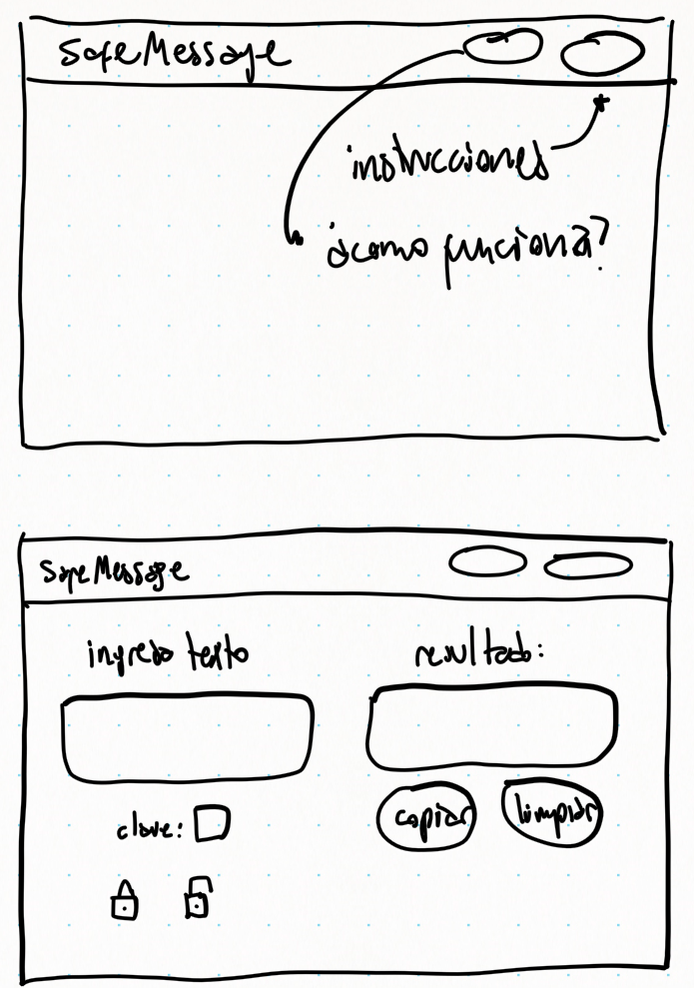

### Definición del Producto

¿Sabes cuántos mensajes se envían solo por Whatsapp en un minuto alrededor del mundo? 38 millones de mensajes, si leiste bien y en tan solo un minuto. Ahora piensa en la cantidad de mensajes que envías dia a dia por múltiples plataformas digitales, muchos de estos mensajes contienen información sensible y en algunos casos privada, no es muy difícil sentirse vulnerable al enviar esta información por la red esperando que si alguien más logra tener acceso a ella no la use de mala manera.

Es por esto que desarrollamos SafeMessage es una aplicación web que permite resguardar tus mensajes por medio de un cifrado en base a una clave numérica, de esta manera la información que envias de manera cifrada sólo podrá ser descifrada solo por quien tu deseas a través de una clave numérica. 

#### ¿Como funciona? 

SafeMessage funciona en base a un tipo de cifrado básico (Caesar Cipher), el cual por medio de una clave numérica nos permite cifrar y descifrar tus mensajes, ya sea que estos contengan información sensible, datos personales o conversaciones íntimas; Te ayudamos a resguardar la confidencialidad de estos, para que al momento de compartirlos a través de un medio digital puedan ser descifrados solo por quien tu quieras. 
Es importante que compartas la clave numérica sólo a quien envías el mensaje cifrado pues de esta manera podrá realizar la operación de descifrar el mensaje.

Puedes revisar el demo [AQUI](https://majosalazar.github.io/scl-2018-11-bc-core-cipher/)

#### ¿Quiénes son los principales usuarios?

Los chilenos pasamos alrededor de 5 horas dias usando el celular, gran parte de ese tiempo es utilizado para comunicarse con otras personas, enviando desde información sensibles, datos privados hasta mensajes íntimos, muchas veces sintiéndose vulnerables pensando en que alguien más pueda leer sus mensajes. Es por esto SafeMessage está enfocado a personas de entre los 15  y 45 años, usuarios que utilizan frecuentes medios digitales para comunicarse. Buscamos resguardar el contenido de sus mensajes, por medio de una herramienta de uso simple e intuitivo.

##### Planificación de desarrollo del proyecto

[Revisa mi planificación en Trello](https://trello.com/invite/b/mWIwMHvx/54e9c4823eb50cac98ae308c66fb4d75/cifrado-cesar)

#### Deciciones de diseño

##### Flujo de la aplicación

La aplicación se desarrolló bajo un flujo de trabajo simple, que evita pasos intermedios innecesarios que puedan complejizar el en entendimiento del usuario al momento de ejecutar las diversas acciones.

##### Prototipo de baja calidad

El primer maquetado de la aplicación consideraba una distribución vertical de los componentes, lo que generaba el desperdicio de una gran porción del ancho de la pantalla.

En la segunda versión del maquetado se implementó una distribución que aprovecha de mejor manera el ancho de la pantalla, evitando que en el uso en pc de la aplicación el usuario tuviese que hacer scroll para ver el resultado, también se cambió el texto en los botones por iconos.

Finalmente la 1ra versión funcional de se ve esta forma, se desarrolló la marca SafeMessage como respuesta a la problemática que se determinó anteriormente, se definió la paleta de colores de la marca, el diseño del logo y el uso de botones con iconos. 
 

#### Resultados del testeo

La aplicación fue testeada por 4 usuarios, de los cuales 3 pudieron hacer uso de esta de manera fluida. Los principales comentarios recibidos fueron:

- Los botones de “¿cómo funciona?” e “instrucciones” no se resaltan lo suficiente.
- El color de los botones de los candados se confunde con el fondo.
- Los iconos en los botones se dan a entender, pero sería bueno incluir un globo con información de para qué sirven.
- La ubicación de los botones de candado sería más cómoda si estuvieran en el medio, como el traductor de google.

#### Elementos a Iterar

En base al feedback recibido sobre la aplicación vamos a iterar sobre una mejor visualización de los elementos modificando el color de fondo, el tamaño y el color de los botones, también se agregaran “tooltips” a estos últimos a fin de entregar a los usuarios información sobre la función de cada uno. Finalmente trabajaremos sobre una nueva disposición de los elementos, a fin de permitir un flujo de uso más fluido.
